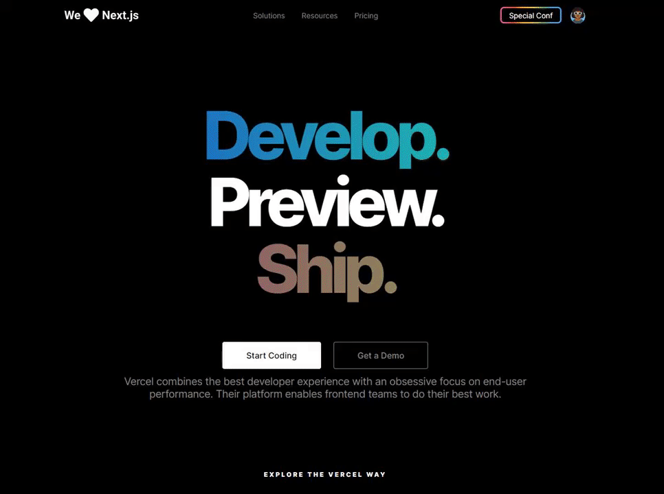

<h1 align="center">Vercel Page Clone</h1>

<div align="center">



</div>

---

<p align="center"> A project that clones Vercel Page.
    <br> 
</p>

## 📝 Table of Contents

- [About](#about)
- [Getting Started](#getting_started)
- [Inspiration](#inspiration)

## 🧐 About <a name = "about"></a>

This project was done in order to learn more SCSS and Animations.

## 🏁 Getting Started <a name = "getting_started"></a>

These instructions will get you a copy of the project up and running on your local machine for development and testing purposes.

### How to clone the project:

A step by step series of examples that tell you how to get a development env running.

First you have to run: 

```
git clone https://github.com/lucas-hgs/vercel-homepage-clone
```

And then you have to open the "index.html" file. You'll be able to see the Image Slider in action!

Note:
>If you're using Visual Studio Code, it's preferable that you run the application with the "Live Server" extension. That way, if you want to edit something, you can see it live, without the need to refresh the page! =)

## 👨‍🎓 Inspiration <a name = "inspiration"></a>

This project was inspired in a video made by Guilherme Rodz on Rocketseat channel at YouTube, if you want to see more of his work, please check out [Rocketseat channel](https://www.youtube.com/channel/UCSfwM5u0Kce6Cce8_S72olg) or his personal Github Profile at [@guilhermerodz](https://github.com/guilhermerodz)!